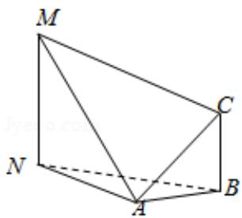

<!-- question-source:start -->
16.（5分）如图，为测量山高MN，选择A和另一座的山顶C为测量观测点，从A

点测得 M 点的仰角 $\angle MAN=60^{\circ}$ ，C 点的仰角 $\angle CAB=45^{\circ}$ 以及 $\angle MAC=75^{\circ}$ ；从 C

点测得 $\angle MCA=60^{\circ}$ ，已知山高 $BC=100m$ ，则山高 $MN=$ \_\_\_\_ m.

<!-- question-source:end -->

![[高中/真题/按年份分类/2014/2014年全国统一高考数学试卷_文科__新课标ⅰ__含解析版_/填空题/题目/answers/Q00027439A1.md]]
