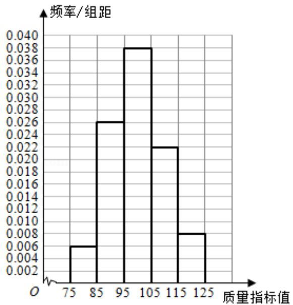

> [!faq]- 2014年全国统一高考数学试卷（文科）（新课标ⅰ）（含解析版）解析
>
> > [!success]- **【答案】** (12 分) 从某企业生产的产品中抽取
>
> > [!note]- **【分析】**
> > （1）根据频率分布直方图做法画出即可；
> > (2) 用样本平均数和方差来估计总体的平均数和方差，代入公式计算即可.
> > (3) 求出质量指标值不低于 95 的产品所占比例的估计值，再和 0.8 比较即可.
>
> > [!note]- **【解析】**
> > 解：
> > （1）频率分布直方图如图所示：
> >
> > 
> >
> > ( 2 ) 质量指标的样本平均数为 $\overline{\mathbf{x}}$
> >
> > $= 80 \times 0.06 + 90 \times 0.26 + 100 \times 0.38 + 110 \times 0.22 + 120 \times 0.08 = 100,$
> >
> > 质量指标的样本的方差为 $S^2 = (-20)^{2} \times 0.06 + (-$
> >
> > $$
> > 1 0) ^ {2} \times 0. 2 6 + 0 \times 0. 3 8 + 1 0 ^ {2} \times 0. 2 2 + 2 0 ^ {2} \times 0. 0 8 = 1 0 4,
> > $$
> >
> > 这种产品质量指标的平均数的估计值为 100，方差的估计值为 104.
> > (3) 质量指标值不低于 95 的产品所占比例的估计值为 $0.38 + 0.22 + 0.08 = 0.68$ ,
> >
> > 由于该估计值小于 0.8，故不能认为该企业生产的这种产品符合“质量指标值不
> >
> > 低于 95 的产品至少要占全部产品 80%”的规定.
