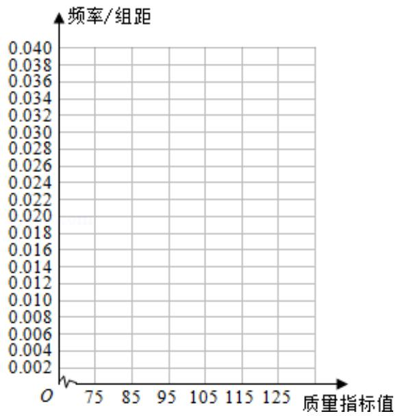

<!-- question-source:start -->
18.（12分）从某企业生产的产品中抽取100件，测量这些产品的一项质量指标值

由测量结果得如下频数分布表：

<table><tr><td>质量指标值分组</td><td>[75, 85)</td><td>[85, 95)</td><td>[95, 105)</td><td>[105, 115)</td><td>[115, 125)</td></tr><tr><td>频数</td><td>6</td><td>26</td><td>38</td><td>22</td><td>8</td></tr></table>

(1) 在表格中作出这些数据的频率分布直方图;

  
(2) 估计这种产品质量指标的平均数及方差（同一组中的数据用该组区间的中点值作代表）；

(3) 根据以上抽样调查数据, 能否认为该企业生产的这种产品符合 “质量指标值不低于 95 的产品至少要占全部产品 80%” 的规定?
<!-- question-source:end -->

![[高中/真题/按年份分类/2014/2014年全国统一高考数学试卷_文科__新课标ⅰ__含解析版_/解答题/题目/answers/Q00027051A1.md]]
