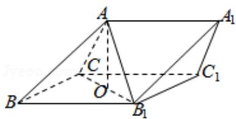

<!-- question-source:start -->
19.（12分）如图，三棱柱 ABC - A₁B₁C₁ 中，侧面 BB₁C₁C 为菱形，B₁C 的中点为 O，且

AO⊥平面BB₁C₁C.

(1) 证明: $B_{1} C \perp A B$ ;

(2) 若 $AC \perp AB_{1}$ ， $\angle CBB_{1}=60^{\circ}$ ，BC=1，求三棱柱 $ABC-A_{1}B_{1}C_{1}$ 的高.

<!-- question-source:end -->

![[高中/真题/按年份分类/2014/2014年全国统一高考数学试卷_文科__新课标ⅰ__含解析版_/解答题/题目/answers/Q00027052A1.md]]
