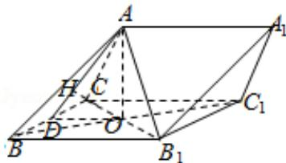

> [!faq]- 2014年全国统一高考数学试卷（文科）（新课标ⅰ）（含解析版）解析
>
> > [!success]- **【答案】** 详见解析
>
> > [!note]- **【分析】**
> > （1）连接 $BC_{1}$ ，则 O 为 $B_{1}C$ 与 $BC_{1}$ 的交点，证明 $B_{1}C \perp$ 平面 ABO，可得
>
> > [!note]- **【解析】**
> > 分析】（1）连接 $BC_{1}$ ，则 O 为 $B_{1}C$ 与 $BC_{1}$ 的交点，证明 $B_{1}C \perp$ 平面 ABO，可得
> >
> > $B_{1}C \perp AB;$
> >
> > (2) 作 OD⊥BC，垂足为 D，连接 AD，作 OH⊥AD，垂足为 H，证明 $\triangle CBB_{1}$ 为等边三
> >
> > 角形，求出 $B_{1}$ 到平面 ABC 的距离，即可求三棱柱 $ABC - A_{1}B_{1}C_{1}$ 的高.
> >
> > 【
> > 解答】（1）证明：连接 $\mathrm{BC}_{1}$ ，则 O 为 $\mathrm{B}_{1} \mathrm{C}$ 与 $\mathrm{BC}_{1}$ 的交点，
> >
> > ∵侧面 $BB_{1}C_{1}C$ 为菱形，
> >
> > $\therefore BC_{1}\perp B_{1}C,$
> >
> > ∵AO⊥平面BB $_{1}$ C $_{1}$ C，
> >
> > $\therefore AO \perp B_{1}C,$
> >
> > ∵AO∩BC $_{1}$ =O,
> >
> > $\therefore B_{1}C \perp$ 平面 ABO,
> >
> > ∵ABC平面ABO，
> >
> > $\therefore B_{1}C \perp AB;$
> >
> > (2) 解: 作 $OD \perp BC$ , 垂足为 $D$ , 连接 $AD$ , 作 $OH \perp AD$ , 垂足为 $H$ ,
> >
> > $$
> > \because B C \perp A O, B C \perp O D, A O \cap O D = O,
> > $$
> >
> > ∴BC⊥平面 AOD，
> >
> > $\therefore OH \perp BC,$
> >
> > ∵OH⊥AD, BC∩AD=D,
> >
> > $\therefore OH \perp$ 平面 ABC,
> >
> > $$
> > \because \angle C B B _ {1} = 6 0 ^ {\circ},
> > $$
> >
> > $\therefore \triangle CBB_{1}$ 为等边三角形，
> >
> > $$
> > \because \mathrm{BC} = 1, \therefore \mathrm{OD} = \frac {\sqrt {3}}{4},
> > $$
> >
> > $$
> > \because A C \perp A B _ {1}, \therefore O A = \frac {1}{2} B _ {1} C = \frac {1}{2},
> > $$
> >
> > 由 $OH \cdot AD = OD \cdot OA$ ，可得 $AD = \sqrt{OD^{2} + OA^{2}} = \frac{\sqrt{7}}{4}$ ，∴ $OH = \frac{\sqrt{21}}{14}$ ，
> >
> > ∵O为 $B_{1}C$ 的中点，
> >
> > $\therefore B_{1}$ 到平面ABC的距离为 $\frac{\sqrt{21}}{7}$
> >
> > ∴三棱柱 ABC - A₁B₁C₁ 的高 $\frac{\sqrt{21}}{7}$ .
> >
> > 
> >
> > 【点评】本题考查线面垂直的判定与性质,考查点到平面距离的计算,考查学生分
> >
> > 析解决问题的能力，属于中档题.
