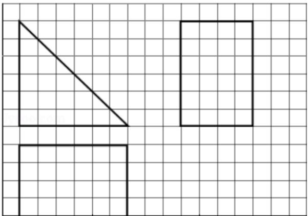

<!-- question-source:start -->
8.（5分）如图，网格纸的各小格都是正方形，粗实线画出的是一个几何体的三视

图，则这个几何体是（）

A. 三棱锥 B. 三棱柱 C. 四棱锥 D. 四棱柱

【考点】L7：简单空间图形的三视图.

【专题】5F：空间位置关系与距离.
<!-- question-source:end -->

![[高中/真题/按年份分类/2014/2014年全国统一高考数学试卷_文科__新课标ⅰ__含解析版_/选择题/题目/answers/Q00030583A1.md]]
