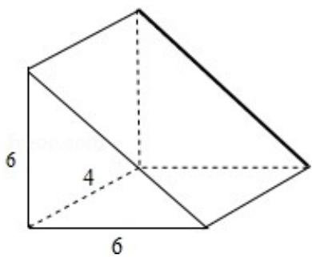

> [!faq]- 2014年全国统一高考数学试卷（文科）（新课标ⅰ）（含解析版）解析
>
> > [!success]- **【答案】** B
>
> > [!note]- **【分析】**
> > 由题意画出几何体的图形即可得到选项.
>
> > [!note]- **【解析】**
> > 解: 根据网格纸的各小格都是正方形, 粗实线画出的是一个几何体的三视图,
> >
> > 可知几何体如图：几何体是三棱柱.
> >
> > 故选：B.
> >
> > 
> >
> > 【点评】本题考查三视图复原几何体的直观图的判断方法，考查空间想象能力.
