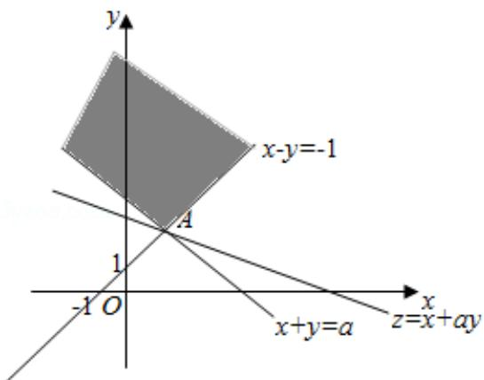

> [!faq]- 2014年全国统一高考数学试卷（文科）（新课标ⅰ）（含解析版）解析
>
> > [!success]- **【答案】** B
>
> > [!note]- **【分析】**
> > 如图所示，当 $a \geq 1$ 时，由 $\left\{ \begin{array}{l} x - y = -1 \\ x + y = a \end{array} \right.$ ，解得 $A\left(\frac{a - 1}{2}, \frac{a + 1}{2}\right)$ . 当直线 $z = x + ay$ 经过 $A$ 点时取得最小值为 7，同理对 $a < 1$ 得出.
>
> > [!note]- **【解析】**
> > 解：如图所示，
> >
> > 当 $a \geq 1$ 时，由 $\left\{ \begin{array}{l} x - y = -1 \\ x + y = a \end{array} \right.$ ，
> >
> > 解得 $x=\frac{a-1}{2}$ ， $y=\frac{a+1}{2}$ .
> >
> > $$
> > \therefore \mathrm{A} \left(\frac {\mathrm{a} - 1}{2}, \frac {\mathrm{a} + 1}{2}\right)
> > $$
> >
> > 当直线 $z=x+ay$ 经过 A 点时取得最小值为 7，
> >
> > $\therefore 7 = \frac{a - 1}{2} +\frac{a(a + 1)}{2}$ ，化为 $a^2 +2a - 15 = 0$
> >
> > 解得 a=3，a=-5 舍去。
> >
> > 当 $a < 1$ 时，不符合条件.
> >
> > 故选：B.
> >
> > 
> >
> > 【点评】本题考查了线性规划的有关知识、直线的斜率与交点，考查了数形结合的思想方法，属于中档题.
