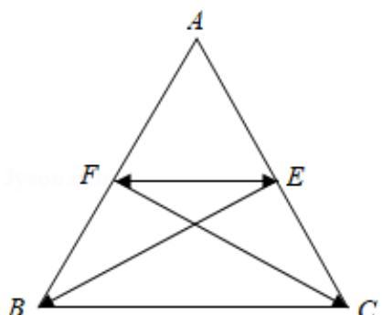

> [!faq]- 2014年全国统一高考数学试卷（文科）（新课标ⅰ）（含解析版）解析
>
> > [!success]- **【答案】** A
>
> > [!note]- **【分析】**
> > 利用向量加法的三角形法则，将 $\overrightarrow{EB}$ ， $\overrightarrow{FC}$ 分解为 $\overrightarrow{EF} + \overrightarrow{FB}$ 和 $\overrightarrow{FE} + \overrightarrow{EC}$ 的形式，进
>
> > [!note]- **【解析】**
> > 解：∵D，E，F分别为△ABC的三边BC，CA，AB的中点，
> >
> > $$
> > \therefore \overrightarrow {E B} + \overrightarrow {F C} = (\overrightarrow {E F} + \overrightarrow {F B}) + (\overrightarrow {F E} + \overrightarrow {E C}) = \overrightarrow {F B} + \overrightarrow {E C} = \frac {1}{2} (\overrightarrow {A B} + \overrightarrow {A C}) = \overrightarrow {A D},
> > $$
> >
> > 故选：A.
> >
> > 
> >
> > 【点评】本题考查的知识点是向量在几何中的应用，熟练掌握向量加法的三角形
> >
> > 法则和平行四边形法则是解答的关键.
> >
> > $$
