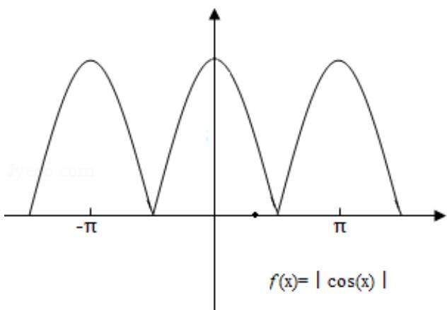

> [!faq]- 2014年全国统一高考数学试卷（文科）（新课标ⅰ）（含解析版）解析
>
> > [!success]- **【答案】** A
>
> > [!note]- **【分析】**
> > 根据三角函数的周期性，求出各个函数的最小正周期，从而得出结论.
>
> > [!note]- **【解析】**
> > 解：∵函数① $y=\cos |2x|= \cos 2x$ ，它的最小正周期为 $\frac{2\pi}{2}=\pi$ ，
> > ②y=|cosx|的最小正周期为 $\frac{1}{2}\cdot\frac{2\pi}{1}=\pi$ ,
> > ③ $y=\cos(2x+\frac{\pi}{6})$ 的最小正周期为 $\frac{2\pi}{2}=\pi$ ,
> > ④ $y=\tan(2x-\frac{\pi}{4})$ 的最小正周期为 $\frac{\pi}{2}$ ,
> >
> > 故选：A.
> >
> > 
> >
> > 【点评】本题主要考查三角函数的周期性及求法，属于基础题.
