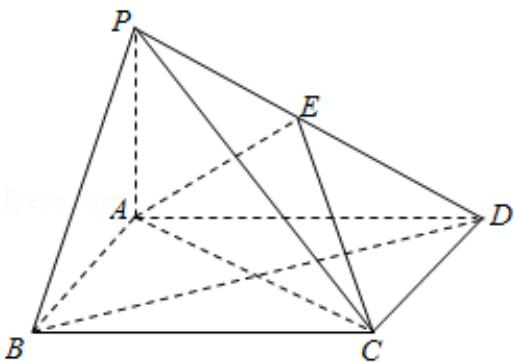

<!-- question-source:start -->
18. (12 分) 如图, 四棱锥 P - ABCD 中, 底面 ABCD 为矩形, PA⊥平面 ABCD, E 为 PD 的中点.

（Ⅰ）证明：PB∥平面 AEC；

（II）设 $AP = 1$ ， $\mathrm{AD} = \sqrt{3}$ ，三棱锥P-ABD的体积 $V = \frac{\sqrt{3}}{4}$ ，求A到平面PBC的距离.

<!-- question-source:end -->

![[高中/真题/按年份分类/2014/2014年全国统一高考数学试卷_文科__新课标ⅱ__含解析版_/填空题/题目/answers/Q00027130A1.md]]
