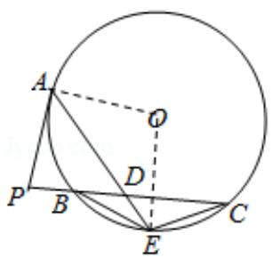

> [!faq]- 2014年全国统一高考数学试卷（文科）（新课标ⅱ）（含解析版）解析
>
> > [!success]- **【答案】** 详见解析
>
> > [!note]- **【分析】**
> > （Ⅰ）连接 OE，OA，证明 OE⊥BC，可得 E 是 BC 的中点，从而 BE=EC；
>
> > [!note]- **【解析】**
> > 分析】（Ⅰ）连接 OE，OA，证明 OE⊥BC，可得 E 是 BC 的中点，从而 BE=EC；
> >
> > （II）利用切割线定理证明 PD=2PB，PB=BD，结合相交弦定理可得 $AD \cdot DE = 2PB^{2}$ .
> >
> > 【
> > 解答】证明：（Ⅰ）连接 OE，OA，则 $\angle OAE = \angle OEA$ ， $\angle OAP = 90^{\circ}$ ，
> >
> > ∵PC=2PA，D为PC的中点，
> >
> > $\therefore PA=PD,$
> >
> > $\therefore \angle PAD = \angle PDA,$
> >
> > $\because \angle PDA = \angle CDE,$
> >
> > $\therefore \angle OEA + \angle CDE = \angle OAE + \angle PAD = 90^{\circ},$
> >
> > $\therefore OE \perp BC,$
> >
> > $\therefore E$ 是 $\widehat{BC}$ 的中点，
> >
> > $$
> > \therefore B E = E C;
> > $$
> >
> > （II）∵PA 是切线，A 为切点，割线 PBC 与 ⊙O 相交于点 B，C，
> >
> > $$
> > \therefore \mathrm{PA} ^ {2} = \mathrm{PB} \bullet \mathrm{PC},
> > $$
> >
> > $$
> > \because \mathrm{PC} = 2 \mathrm{PA},
> > $$
> >
> > $$
> > \therefore \mathrm{PA} = 2 \mathrm{PB},
> > $$
> >
> > $\therefore PD=2PB,$
> >
> > $\therefore \mathrm{PB} = \mathrm{BD},$
> >
> > $$
> > \therefore B D \bullet D C = P B \bullet 2 P B,
> > $$
> >
> > ∵AD•DE=BD•DC,
> >
> > $\therefore AD \cdot DE = 2PB^{2}.$
> >
> > 
> >
> > 【点评】本题考查与圆有关的比例线段，考查切割线定理、相交弦定理，考查学生
> >
> > 分析解决问题的能力，属于中档题.
> >
> > ##
> > 四、选修4-4，坐标系与参数方程
