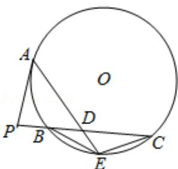

<!-- question-source:start -->
22.（10分）如图，P是⊙O外一点，PA是切线，A为切点，割线PBC与⊙O相交于

点 B，C，PC=2PA，D 为 PC 的中点，AD 的延长线交 $\odot O$ 于点 E，证明：

( I ) BE=EC;

(II) AD•DE=2PB $^{4}$ .

## 四、选修4-4，坐标系与参数方程
<!-- question-source:end -->

![[高中/真题/按年份分类/2014/2014年全国统一高考数学试卷_文科__新课标ⅱ__含解析版_/解答题/题目/answers/Q00027134A1.md]]
