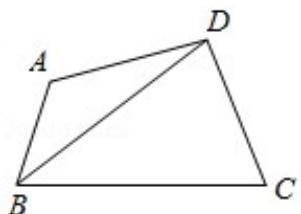

> [!faq]- 2014年全国统一高考数学试卷（文科）（新课标ⅱ）（含解析版）解析
>
> > [!success]- **【答案】** 详见解析
>
> > [!note]- **【分析】**
> > (1) 在三角形 BCD 中, 利用余弦定理列出关系式, 将 BC, CD, 以及 cosC 的
>
> > [!note]- **【解析】**
> > 解：
> > （1）在 $\triangle BCD$ 中， $BC=3$ ， $CD=2$ ，
> >
> > 由余弦定理得： $BD^{2}=BC^{2}+CD^{2}-2BC\cdot CD\cos C=13-12\cos C①$
> >
> > 在 $\triangle ABD$ 中，AB=1，DA=2，A+C= $\pi$ ，
> >
> > 由余弦定理得： $BD^{2}=AB^{2}+AD^{2}-2AB\cdot AD\cos A=5-4\cos A=5+4\cos C$ ②，
> >
> > 由①②得： $\cos C=\frac{1}{2}$ ,
> >
> > 则 $C=60^{\circ}$ ， $BD=\sqrt{7}$ ;
> >
> > $$
> > \because \cos C = \frac {1}{2}, \cos A = - \frac {1}{2}, \tag {2}
> > $$
> >
> > $$
> > \therefore \sin C = \sin A = \frac {\sqrt {3}}{2},
> > $$
> >
> > 则 $S = \frac{1}{2} AB\cdot DA\sin A + \frac{1}{2} BC\cdot CD\sin C = \frac{1}{2}\times 1\times 2\times \frac{\sqrt{3}}{2} +\frac{1}{2}\times 3\times 2\times \frac{\sqrt{3}}{2} = 2\sqrt{3}.$
> >
> > 
> >
> > 【点评】此题考查了余弦定理，同角三角函数间的基本关系，以及三角形面积公式，
> >
> > 熟练掌握余弦定理是解本题的关键.
