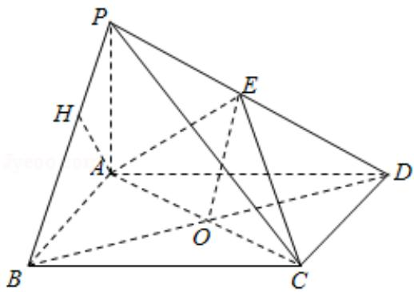

> [!faq]- 2014年全国统一高考数学试卷（文科）（新课标ⅱ）（含解析版）解析
>
> > [!success]- **【答案】** 详见解析
>
> > [!note]- **【分析】**
> > （Ⅰ）设 BD 与 AC 的交点为 O，连结 EO，通过直线与平面平行的判定定理
>
> > [!note]- **【解析】**
> > 解：（Ⅰ）证明：设 BD 与 AC 的交点为 O，连结 EO，
> >
> > ∵ABCD 是矩形，
> >
> > ∴O 为 BD 的中点
> >
> > ∵E 为 PD 的中点，
> >
> > $\therefore EO\|PB.$
> >
> > EOC平面 AEC，PB∅平面 AEC
> >
> > ∴PB∥平面 AEC;
> >
> > （II）∵AP=1，AD= $\sqrt{3}$ ，三棱锥P-ABD的体积V= $\frac{\sqrt{3}}{4}$ ,
> >
> > $$
> > \therefore V = \frac {1}{6} P A \cdot A B \cdot A D = \frac {\sqrt {3}}{6} A B = \frac {\sqrt {3}}{4},
> > $$
> >
> > $$
> > \therefore A B = \frac {3}{2}, P B = \sqrt {1 + \left(\frac {3}{2}\right) ^ {2}} = \frac {\sqrt {1 3}}{2}.
> > $$
> >
> > 作 AH⊥PB 交 PB 于 H,
> >
> > 由题意可知 BC⊥平面 PAB，
> >
> > ∴BC⊥AH,
> >
> > 故 AH⊥平面 PBC.
> >
> > 又在三角形 PAB 中，由射影定理可得： $AH=\frac{PA\cdot AB}{PB}=\frac{3\sqrt{13}}{13}$
> >
> > A 到平面 PBC 的距离 $\frac{3\sqrt{13}}{13}$ .
> >
> > 
> >
> > 【点评】本题考查直线与平面垂直, 点到平面的距离的求法, 考查空间想象能力以及计算能力.
