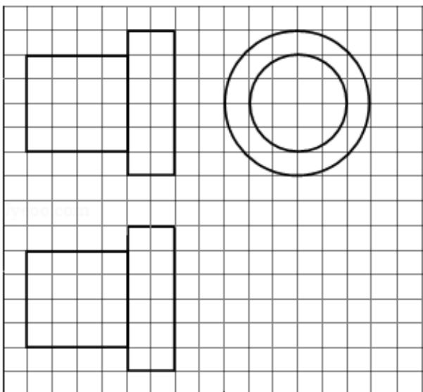

<!-- question-source:start -->
6. (5 分) 如图, 网格纸上正方形小格的边长为 1 (表示 $1 \mathrm{~cm}$ ), 图中粗线画出的是某零件的三视图, 该零件由一个底面半径为 $3 \mathrm{~cm}$ , 高为 $6 \mathrm{~cm}$ 的圆柱体毛坯切削得到, 则切削掉部分的体积与原来毛坯体积的比值为 ( )

A. $\frac{17}{27}$ B. $\frac{5}{9}$ C. $\frac{10}{27}$ D. $\frac{1}{3}$
<!-- question-source:end -->

![[高中/真题/按年份分类/2014/2014年全国统一高考数学试卷_文科__新课标ⅱ__含解析版_/选择题/题目/answers/Q00027119A1.md]]
