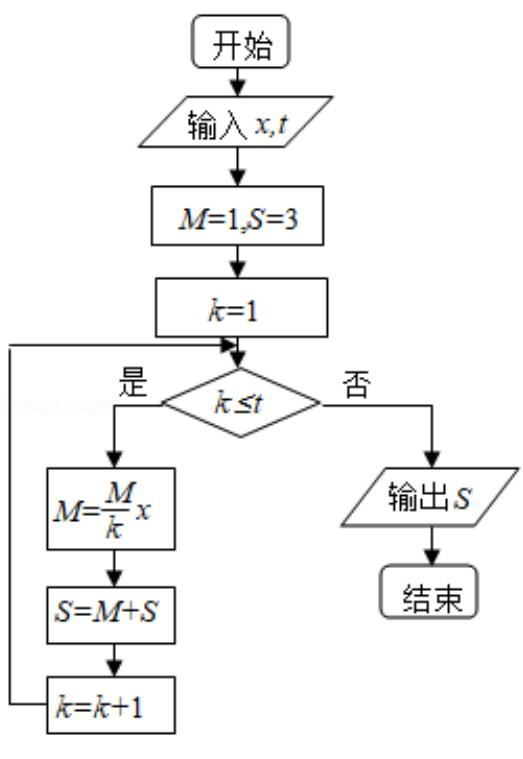

<!-- question-source:start -->
8.（5分）执行如图所示的程序框图，若输入的 $x, t$ 均为2，则输出的 $S = (\quad)$

A. 4 B. 5 C. 6 D. 7
<!-- question-source:end -->

![[高中/真题/按年份分类/2014/2014年全国统一高考数学试卷_文科__新课标ⅱ__含解析版_/选择题/题目/answers/Q00027121A1.md]]
