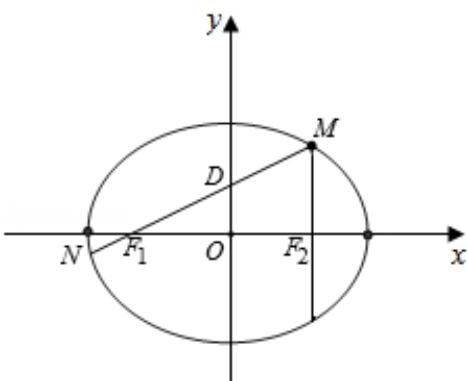

> [!faq]- 2014年全国统一高考数学试卷（文科）（新课标ⅱ）（含解析版）解析
>
> > [!success]- **【答案】** 详见解析
>
> > [!note]- **【分析】**
> > 本题未单列分析。
>
> > [!note]- **【解析】**
> > 解答】解：（1）∵M是C上一点且 $MF_{2}$ 与x轴垂直，
> >
> > ∴M 的横坐标为 c，当 x=c 时， $y=\frac{b^{2}}{a}$ ，即 M（c， $\frac{b^{2}}{a}$ ），
> >
> > 若直线 MN 的斜率为 $\frac{3}{4}$ ,
> >
> > 即 $\tan \angle MF_{1}F_{2} = \frac{b^{2}}{a}$ $= \frac{b^{2}}{2ac} = \frac{3}{4}$
> >
> > 即 $b^{2} = \frac{3}{2} ac = a^{2} - c^{2}$ ,
> >
> > 即 $c^2 + \frac{3}{2} ac - a^2 = 0$
> >
> > 则 $e^{2}+\frac{3}{2}e-1=0$ ，
> >
> > 即 $2\mathrm{e}^2 +3\mathrm{e} - 2 = 0$
> >
> > 解得 $e=\frac{1}{2}$ 或 e=-2 （舍去），
> >
> > 即 $e=\frac{1}{2}$ .
> >
> > （II）由题意，原点O是 $F_{1}F_{2}$ 的中点，则直线 $MF_{1}$ 与y轴的交点D(0,2)是线段 $MF_{1}$
> >
> > 的中点，
> >
> > 设 M (c, y)，(y > 0)，
> >
> > 则 $\frac{c^2}{a^2} +\frac{y^2}{b^2} = 1$ ，即 $y^{2} = \frac{b^{4}}{a^{2}}$ ，解得 $y = \frac{b^2}{a}$
> >
> > ∵OD 是 $\triangle MF_{1}F_{2}$ 的中位线，
> >
> > $\therefore \frac{b^{2}}{a} = 4$ ，即 $b^{2} = 4a$
> >
> > 由 $|MN|=5|F_{1}N|$ ,
> >
> > 则 $\left|MF_{1}\right|=4\left|F_{1}N\right|$ ,
> >
> > 解得 $\left|DF_{1}\right|=2\left|F_{1}N\right|$ ,
> >
> > 即 $\overrightarrow{DF_1} = 2\overrightarrow{F_1N}$
> >
> > 设 $N(x_{1}, y_{1})$ ，由题意知 $y_{1}<0$ ，
> >
> > 则 $(-c, -2) = 2(x_1 + c, y_1)$ .
> >
> > 即 $\left\{\begin{aligned}2(x_{1}+c)=-c\\ 2y_{1}=-2\end{aligned}\right.$ ，即 $\left\{\begin{aligned}x_{1}&=-\frac{3}{2}c\\ y_{1}&=-1\end{aligned}\right.$
> >
> > 代入椭圆方程得 $\frac{9c^2}{4a^2} +\frac{1}{b^2} = 1$
> >
> > 将 $b^{2}=4a$ 代入得 $\frac{9(a^{2}-4a)}{4a^{2}}+\frac{1}{4a}=1$ ，
> >
> > 解得 a=7， $b=2\sqrt{7}$ .
> >
> > 
> >
> > 【点评】本题主要考查椭圆的性质, 利用条件建立方程组, 利用待定系数法是解决
> >
> > 本题的关键，综合性较强，运算量较大，有一定的难度.
