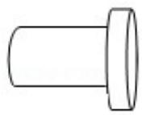

> [!faq]- 2014年全国统一高考数学试卷（文科）（新课标ⅱ）（含解析版）解析
>
> > [!success]- **【答案】** C
>
> > [!note]- **【分析】**
> > 由三视图判断几何体的形状, 通过三视图的数据求解几何体的体积即可.
>
> > [!note]- **【解析】**
> > 解: 几何体是由两个圆柱组成, 一个是底面半径为 3 高为 2, 一个是底面半
> >
> > 径为 2，高为 4，
> >
> > 组合体体积是： $3^{2}\pi\cdot2+2^{2}\pi\cdot4=34\pi$
> >
> > 
> >
> > 底面半径为 $3 \mathrm{~cm}$ , 高为 $6 \mathrm{~cm}$ 的圆柱体毛坯的体积为: $3^{2} \pi \times 6 = 54 \pi$
> >
> > 切削掉部分的体积与原来毛坯体积的比值为： $\frac{54\pi - 34\pi}{54\pi} = \frac{10}{27}$ .
> >
> > 故选：C.
> >
> > 【点评】本题考查三视图与几何体的关系, 几何体的体积的求法, 考查空间想象能
> >
> > 力以及计算能力.
