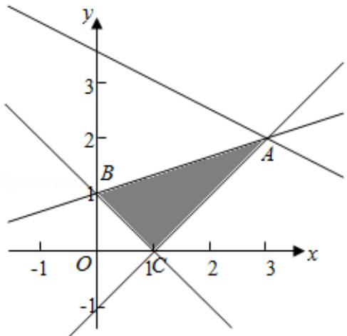

> [!faq]- 2014年全国统一高考数学试卷（文科）（新课标ⅱ）（含解析版）解析
>
> > [!success]- **【答案】** B
>
> > [!note]- **【分析】**
> > 作出不等式对应的平面区域, 利用线性规划的知识, 通过平移即可求 z 的最大值.
>
> > [!note]- **【解析】**
> > 分析】作出不等式对应的平面区域, 利用线性规划的知识, 通过平移即可求 z 的最大值.
> >
> > 【
> > 解答】解：作出不等式对应的平面区域，
> >
> > 由 $z = x + 2y$ ，得 $y = -\frac{1}{2} x + \frac{z}{2}$
> >
> > 平移直线 $y = -\frac{1}{2}x + \frac{z}{2}$ ，由图象可知当直线 $y = -\frac{1}{2}x + \frac{z}{2}$ 经过点 A 时，直线 y = - $\frac{1}{2}x + \frac{z}{2}$ 的截距最大，此时 z 最大.
> > 由 $\left\{\begin{aligned}&x-y-1=0\\&x-3y+3=0\end{aligned}\right.$ ，得 $\left\{\begin{aligned}&x=3\\&y=2\end{aligned}\right.$
> >
> > 即 A（3，2），
> >
> > 此时 z 的最大值为 $z=3+2\times2=7$ ，
> >
> > 故选：B.
> >
> > 
> >
> > 【点评】本题主要考查线性规划的应用，利用数形结合是解决线性规划题目的常
> > 用方法.
