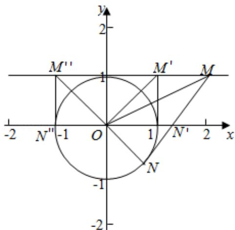

> [!faq]- 2014年全国统一高考数学试卷（文科）（新课标ⅱ）（含解析版）解析
>
> > [!success]- **【答案】** A
>
> > [!note]- **【分析】**
> > 根据直线和圆的位置关系，利用数形结合即可得到结论.
>
> > [!note]- **【解析】**
> > 解：由题意画出图形如图：点 $M(x_{0},1)$ ，要使圆 $O: x^{2}+y^{2}=1$ 上存在点 N，使
> >
> > 得 $\angle OMN=45^{\circ}$ ,
> >
> > 则 $\angle OMN$ 的最大值大于或等于 $45^{\circ}$ 时一定存在点N，使得 $\angle OMN=45^{\circ}$ ，
> >
> > 而当 MN 与圆相切时 $\angle OMN$ 取得最大值，
> >
> > 此时 MN=1，
> >
> > 图中只有 M' 到 M" 之间的区域满足 MN=1，
> >
> > $\therefore x_{0}$ 的取值范围是 $[-1, 1]$ .
> >
> > 故选：A.
> >
> > 
> >
> > 【点评】本题考查直线与圆的位置关系, 直线与直线设出角的求法, 数形结合是快
> >
> > 速解得本题的策略之
> > 一.
> >
> > ##
> > 二、填空题：本大题共4小题，每小题5分.
