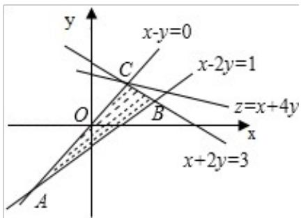

> [!faq]- 2014年全国统一高考数学试卷（理科）（大纲版）（含解析版）解析
>
> > [!success]- **【答案】** . 【
>
> > [!note]- **【分析】**
> > 由约束条件作出可行域,化目标函数为直线方程的斜截式,由图得到最优
>
> > [!note]- **【解析】**
> > 分析】由约束条件作出可行域,化目标函数为直线方程的斜截式,由图得到最优
> >
> > 解，联立方程组求出最优解的坐标，代入目标函数得
> > 答案.
> >
> > 【
> > 解答】解：由约束条件 $\left\{\begin{aligned}x-y&\geqslant0\\ x+2y&\leqslant3\\ x-2y&\leqslant1\end{aligned}\right.$ 作出可行域如图，
> >
> > 
> >
> > 联立 $\left\{\begin{aligned}x-y=0\\ x+2y=3\end{aligned}\right.$ ，解得C（1，1）.
> >
> > 化目标函数 $z = x + 4y$ 为直线方程的斜截式，得 $y = \frac{1}{4} x + \frac{z}{4}$
> >
> > 由图可知，当直线 $y = \frac{1}{4} x + \frac{z}{4}$ 过 $c$ 点时，直线在 $y$ 轴上的截距最大， $z$ 最大.
> >
> > 此时 $z_{max}=1+4\times1=5$ .
> >
> > 故
> > 答案为：5.
> >
> > 【点评】本题考查简单的线性规划，考查了数形结合的解题思想方法，是中档题.
