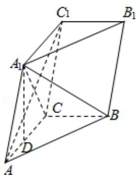

<!-- question-source:start -->
19.
(1) 求 $\{a_{n}\}$ 的通项公式;

(2) 设 $b_n = \frac{1}{a_n a_{n+1}}$ ，求数列 $\{b_n\}$ 的前 $n$ 项和 $T_n$ .

$$
A B C - A _ {1} B _ {1} C _ {1}
$$

$$
\angle A C B = 9 0 ^ {\circ}, \quad B C = 1, \quad A C = C C _ {1} = 2.
$$

(Ⅰ) 证明: $AC_{1} \perp A_{1}B$ ;

（II）设直线 $AA_{1}$ 与平面 $BCC_{1}B_{1}$ 的距离为 $\sqrt{3}$ ，求二面角 $A_{1}-AB-C$ 的大小.

<!-- question-source:end -->

![[高中/真题/按年份分类/2014/2014年全国统一高考数学试卷_理科__大纲版__含解析版_/解答题/题目/answers/Q00029573A1.md]]
