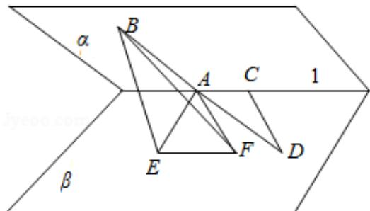

> [!faq]- 2014年全国统一高考数学试卷（理科）（大纲版）（含解析版）解析
>
> > [!success]- **【答案】** B
>
> > [!note]- **【分析】**
> > 首先作出二面角的平面角，然后再构造出异面直线 AB 与 CD 所成角，利用解直角三角形和余弦定理，求出问题的
>
> > [!note]- **【解析】**
> > 分析】首先作出二面角的平面角，然后再构造出异面直线 AB 与 CD 所成角，利用解直角三角形和余弦定理，求出问题的
> > 答案.
> >
> > 【
> > 解答】解: 如图, 过 A 点做 AE⊥I, 使 BE⊥β, 垂足为 E, 过点 A 做 AF∥CD, 过点 E 做
> >
> > EF⊥AE，连接 BF，
> >
> > ∵AE⊥I
> >
> > $\therefore \angle EAC=90^{\circ}$
> >
> > ∵CD∥AF
> >
> > 又 $\angle ACD=135^{\circ}$
> >
> > $$
> > \therefore \angle F A C = 4 5 ^ {\circ}
> > $$
> >
> > $$
> > \therefore \angle E A F = 4 5 ^ {\circ}
> > $$
> >
> > 在 Rt△BEA 中，设 AE=a，则 AB=2a，BE= $\sqrt{3}$ a，
> >
> > 在 Rt△AEF 中，则 EF=a，AF= $\sqrt{2}$ a，
> >
> > 在 Rt△BEF 中，则 BF=2a，
> >
> > ∴异面直线 AB 与 CD 所成的角即是 $\angle BAF$ ，
> >
> > $$
> > \therefore \cos \angle B A F = \frac {A B ^ {2} + A F ^ {2} - B F ^ {2}}{2 A B \cdot A F} = \frac {(2 a) ^ {2} + (\sqrt {2} a) ^ {2} - (2 a) ^ {2}}{2 \times 2 a \times \sqrt {2} a} = \frac {\sqrt {2}}{4}.
> > $$
> >
> > 故选：B.
> >
> > 
> >
> > 【点评】本题主要考查了二面角和异面直线所成的角，关键是构造二面角的平面
> >
> > 角和异面直线所成的角，考查了学生的空间想象能力和作图能力，属于难题.
