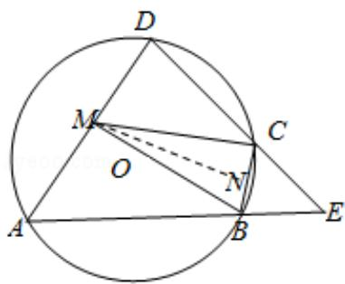

> [!faq]- 2014年全国统一高考数学试卷（理科）（新课标ⅰ）（含解析版）解析
>
> > [!success]- **【答案】** 详见解析
>
> > [!note]- **【分析】**
> > （Ⅰ）利用四边形 ABCD 是 $\odot O$ 的内接四边形，可得 $\angle D = \angle CBE$ ，由 CB = CE，
>
> > [!note]- **【解析】**
> > 分析】（Ⅰ）利用四边形 ABCD 是 $\odot O$ 的内接四边形，可得 $\angle D = \angle CBE$ ，由 CB = CE，
> >
> > 可得 $\angle E = \angle CBE$ ，即可证明： $\angle D = \angle E$
> >
> > （II）设 BC 的中点为 N，连接 MN，证明 AD∥BC，可得 $\angle A = \angle CBE$ ，进而可得
> >
> > $\angle A = \angle E$ ，即可证明 $\triangle ADE$ 为等边三角形.
> >
> > 【
> > 解答】证明：（Ⅰ）∵四边形 ABCD 是 $\odot O$ 的内接四边形，
> >
> > $\therefore \angle D = \angle CBE,$
> >
> > ∵CB=CE,
> >
> > $\therefore\angle E=\angle CBE,$
> >
> > $\therefore \angle D = \angle E;$
> >
> > （II）设 BC 的中点为 N，连接 MN，则由 MB=MC 知 MN⊥BC，
> >
> > ∴O 在直线 MN 上，
> >
> > ∵AD 不是⊙O 的直径，AD 的中点为 M，
> >
> > ∴OM⊥AD,
> >
> > $\therefore AD\|BC,$
> >
> > $\therefore \angle A = \angle CBE,$
> >
> > $\because \angle CBE = \angle E,$
> >
> > $\therefore \angle A = \angle E,$
> >
> > 由（Ⅰ）知， $\angle D = \angle E$
> >
> > $\therefore \triangle ADE$ 为等边三角形.
> >
> > 
> >
> > 【点评】本题考查圆的内接四边形性质, 考查学生
> > 分析解决问题的能力, 属于中档
> >
> > 题.
> >
> > ## 选修 4-4：坐标系与参数方程
