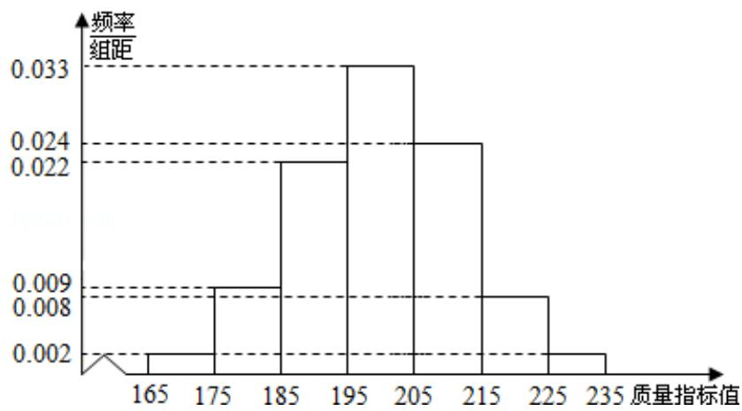

<!-- question-source:start -->
18.（12分）从某企业生产的某种产品中抽取500件，测量这些产品的一项质量指

标值，由测量结果得如下频率分布直方图：

（Ⅰ）求这 500 件产品质量指标值的样本平均数 $\overline{x}$ 和样本方差 $s^{2}$ （同一组中数据用该组区间的中点值作代表）；

（II）由直方图可以认为，这种产品的质量指标值 $z$ 服从正态分布 $\mathsf{N}(\mu, \sigma^2)$ ，其中

$\mu$ 近似为样本平均数 $\overline{x}$ ， $\sigma^{2}$ 近似为样本方差 $s^{2}$ .

(i) 利用该正态分布，求 P（187.8 < z < 212.2）；

(ii) 某用户从该企业购买了 100 件这种产品，记 X 表示这 100 件产品中质量指标

值位于区间（187.8，212.2）的产品件数，利用（i）的结果，求 EX.

附： $\sqrt{150}\approx 12.2$

若 $Z \sim N(\mu, \sigma^2)$ 则 $P(\mu - \sigma < Z < \mu + \sigma) = 0.6826, P(\mu - 2\sigma < Z < \mu + 2\sigma) = 0.
9544.$
<!-- question-source:end -->

![[高中/真题/按年份分类/2014/2014年全国统一高考数学试卷_理科__新课标ⅰ__含解析版_/解答题/题目/answers/Q00024540A1.md]]
