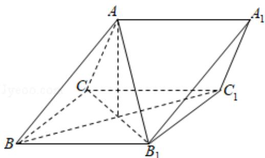

<!-- question-source:start -->
19. （12分）如图，三棱柱 ABC - A₁B₁C₁ 中，侧面 BB₁C₁C 为菱形，AB⊥B₁C.

（Ⅰ）证明： $AC=AB_{1}$ ;

（II）若 $AC \perp AB_{1}$ ， $\angle CBB_{1}=60^{\circ}$ ，AB=BC，求二面角 $A-A_{1}B_{1}-C_{1}$ 的余弦值.

<!-- question-source:end -->

![[高中/真题/按年份分类/2014/2014年全国统一高考数学试卷_理科__新课标ⅰ__含解析版_/解答题/题目/answers/Q00024541A1.md]]
