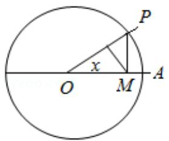
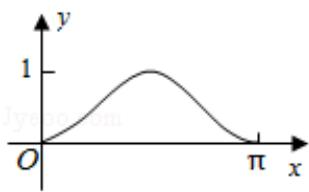
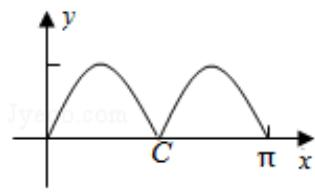
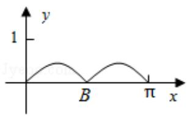
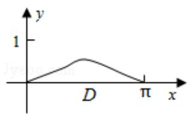

<!-- question-source:start -->
6. (5 分) 如图, 圆 O 的半径为 1, A 是圆上的定点, P 是圆上的动点, 角 x 的始边为射线 OA, 终边为射线 OP, 过点 P 作直线 OA 的垂线, 垂足为 M, 将点 M 到直线 OP 的距离表示为 x 的函数 f(x), 则 y=f(x) 在 [0, π] 的图象大致为 ( )

A.

B.

C.

D.
<!-- question-source:end -->

![[高中/真题/按年份分类/2014/2014年全国统一高考数学试卷_理科__新课标ⅰ__含解析版_/选择题/题目/answers/Q00024528A1.md]]
