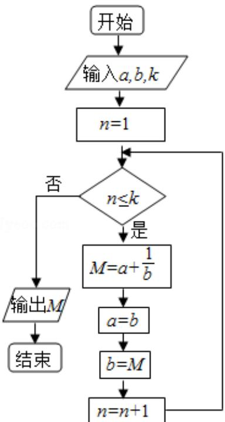

<!-- question-source:start -->
7. (5 分) 执行如图的程序框图, 若输入的 $a, b, k$ 分别为 1, 2, 3, 则输出的 $M = (\quad)$

A. $\frac{20}{3}$ B. $\frac{7}{2}$ C. $\frac{16}{5}$ D. $\frac{15}{8}$
<!-- question-source:end -->

![[高中/真题/按年份分类/2014/2014年全国统一高考数学试卷_理科__新课标ⅰ__含解析版_/选择题/题目/answers/Q00024529A1.md]]
