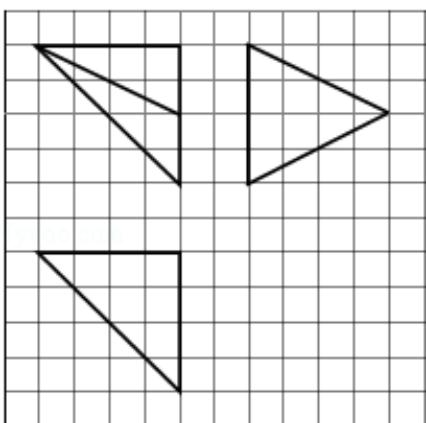

<!-- question-source:start -->
12. (5 分) 如图, 网格纸上小正方形的边长为 1, 粗实线画出的是某多面体的三视
图，则该多面体的各条棱中，最长的棱的长度为（）

A. $6\sqrt{2}$ B. 6 C. $4\sqrt{2}$ D. 4
<!-- question-source:end -->

![[高中/真题/按年份分类/2014/2014年全国统一高考数学试卷_理科__新课标ⅰ__含解析版_/选择题/题目/answers/Q00024534A1.md]]
