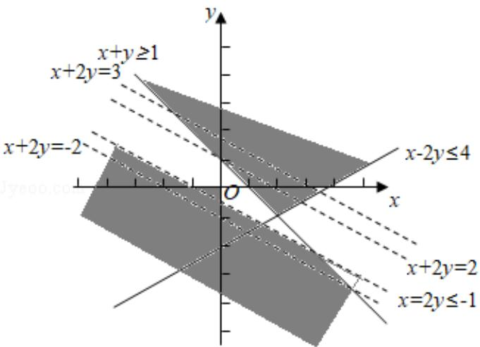

> [!faq]- 2014年全国统一高考数学试卷（理科）（新课标ⅰ）（含解析版）解析
>
> > [!success]- **【答案】** C
>
> > [!note]- **【分析】**
> > 作出不等式组 $\left\{ \begin{array}{l} x + y \geqslant 1 \\ x - 2y \leqslant 4 \end{array} \right.$ 的表示的区域 $D$ ，对四个选项逐一
>
> > [!note]- **【解析】**
> > 解：作出图形如下：
> >
> > 
> >
> > 由图知，区域D为直线 $x + y = 1$ 与 $x - 2y = 4$ 相交的上部角型区域，
> >
> > $p_{1}$ ：区域 D 在 $x+2y \geq -2$ 区域的上方，故： $\forall (x, y) \in D, x+2y \geq -2$ 成立；
> >
> > $p_{2}$ ：在直线 $x+2y=2$ 的右上方和区域 D 重叠的区域内， $\exists(x,y)\in D, x+2y\geq2$ ，故
> >
> > $p_{2}$ : $\exists(x, y) \in D, x+2y \geq 2$ 正确;
> >
> > $p_{3}$ : 由图知, 区域 D 有部分在直线 $x+2y=3$ 的上方, 因此 $p_{3}$ : $\forall(x,y)\in D, x+2y\leq3$
> >
> > 错误；
> >
> > $p_{4}$ ： $x+2y\leq-1$ 的区域（左下方的虚线区域）恒在区域D下方，故 $p_{4}$ ：
> >
> > $\exists(x, y) \in D, x + 2y \leq -1$ 错误；
> >
> > 综上所述， $p_{1}$ 、 $p_{2}$ 正确；
> >
> > 故选：C.
> >
> > 【点评】本题考查命题的真假判断与应用，着重考查作图能力，熟练作图，正确分
> >
> > 析是关键，属于难题。
