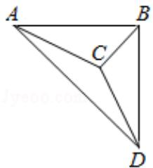

> [!faq]- 2014年全国统一高考数学试卷（理科）（新课标ⅰ）（含解析版）解析
>
> > [!success]- **【答案】** B
>
> > [!note]- **【分析】**
> > 画出图形，结合三视图的数据求出棱长，推出结果即可.
>
> > [!note]- **【解析】**
> > 解：几何体的直观图如图：AB=4，BD=4，C到BD的中点的距离为：4，
> > ∴BC=CD= $\sqrt{2^{2}+4^{2}}=2\sqrt{5}$ . AC= $\sqrt{4^{2}+(2\sqrt{5})^{2}}=6$ , AD= $4\sqrt{2}$ ,
> >
> > 显然 AC 最长．长为 6.
> >
> > 故选：B.
> >
> > 
> >
> > 【点评】本题考查三视图求解几何体的棱长，考查计算能力.
> >
> > ##
> > 二、填空题（共4小题，每小题5分）
