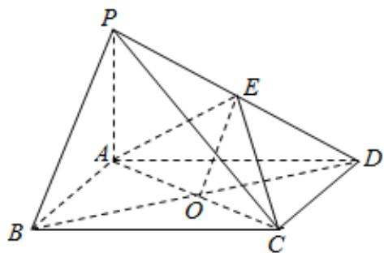
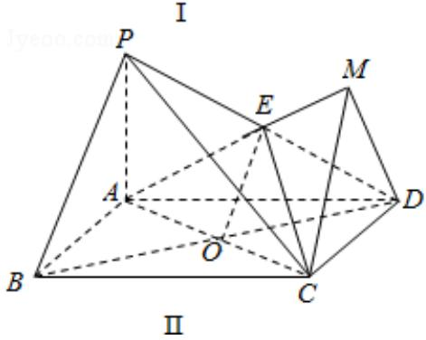

> [!faq]- 2014年全国统一高考数学试卷（理科）（新课标ⅱ）（含解析版）解析
>
> > [!success]- **【答案】** 详见解析
>
> > [!note]- **【分析】**
> > （Ⅰ）连接 BD 交 AC 于 O 点，连接 EO，只要证明 EO∥PB，即可证明 PB∥平
>
> > [!note]- **【解析】**
> > （Ⅰ）证明：连接 BD 交 AC 于 O 点，连接 EO，
> >
> > ∵O为BD中点，E为PD中点，
> >
> > $\therefore EO\|PB,$ (2分)
> >
> > EOC平面 AEC，PB∅平面 AEC，所以 PB∥平面 AEC；（6 分）
> >
> > （II）解：延长 AE 至 M 连结 DM，使得 AM⊥DM，
> >
> > ∵四棱锥 P-ABCD 中，底面 ABCD 为矩形，PA⊥平面 ABCD，
> >
> > ∴CD⊥平面AMD，
> >
> > $\therefore CD \perp MD.$
> >
> > ∵二面角 D-AE-C 为 $60^{\circ}$ ,
> >
> > $\therefore \angle CMD = 60^{\circ},$
> >
> > $\because AP=1, AD=\sqrt{3}, \angle ADP=30^{\circ},$
> >
> > $\therefore PD=2,$
> >
> > E 为 PD 的中点．AE=1，
> >
> > $$
> > \therefore D M = \frac {\sqrt {3}}{2},
> > $$
> >
> > $$
> > \mathrm{CD} = \frac {\sqrt {3}}{2} \times \tan 6 0 ^ {\circ} = \frac {3}{2}.
> > $$
> >
> > 三棱锥 E - ACD 的体积为： $\frac{1}{3} \times \frac{1}{2} AD \cdot CD \cdot \frac{1}{2} PA = \frac{1}{3} \times \frac{1}{2} \times \sqrt{3} \times \frac{3}{2} \times \frac{1}{2} \times 1 = \frac{\sqrt{3}}{8}$ .
> >
> > 
> >
> > 
> >
> > 【点评】本题考查直线与平面平行的判定, 几何体的体积的求法, 二面角等指数的
> >
> > 应用，考查逻辑思维能力，是中档题.
