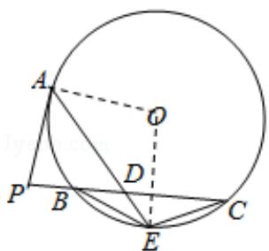

> [!faq]- 2014年全国统一高考数学试卷（理科）（新课标ⅱ）（含解析版）解析
>
> > [!success]- **【答案】** 详见解析
>
> > [!note]- **【分析】**
> > （Ⅰ）连接 OE，OA，证明 OE⊥BC，可得 E 是 BC 的中点，从而 BE=EC；
>
> > [!note]- **【解析】**
> > 证明：（Ⅰ）连接 OE，OA，则 $\angle OAE = \angle OEA, \angle OAP = 90^{\circ}$
> >
> > ∵PC=2PA，D为PC的中点，
> >
> > $$
> > \therefore P A = P D,
> > $$
> >
> > $$
> > \therefore \angle P A D = \angle P D A,
> > $$
> >
> > $\because \angle PDA = \angle CDE,$
> >
> > $$
> > \therefore \angle O E A + \angle C D E = \angle O A E + \angle P A D = 9 0 ^ {\circ},
> > $$
> >
> > $$
> > \therefore O E \perp B C,
> > $$
> >
> > ∴E 是 $\widehat{BC}$ 的中点，
> >
> > $$
> > \therefore B E = E C;
> > $$
> >
> > （II）∵PA是切线，A为切点，割线PBC与⊙O相交于点B，C，
> >
> > $$
> > \therefore P A ^ {2} = P B \bullet P C,
> > $$
> >
> > ∵PC=2PA,
> >
> > $$
> > \therefore \mathrm{PA} = 2 \mathrm{PB},
> > $$
> >
> > $\therefore PD=2PB,$
> >
> > $\therefore PB=BD,$
> >
> > $$
> > \therefore B D \bullet D C = P B \bullet 2 P B,
> > $$
> >
> > $$
> > \because A D \bullet D E = B D \bullet D C,
> > $$
> >
> > $\therefore AD\cdot DE=2PB^{2}.$
> >
> > 
> >
> > 【点评】本题考查与圆有关的比例线段，考查切割线定理、相交弦定理，考查学生
