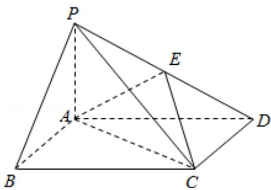

<!-- question-source:start -->
18. (12 分) 如图, 四棱锥 P - ABCD 中, 底面 ABCD 为矩形, PA⊥平面 ABCD, E 为 PD 的中点.

（Ⅰ）证明：PB∥平面 AEC；

（II）设二面角 D-AE-C 为 $60^{\circ}$ ，AP=1， $AD=\sqrt{3}$ ，求三棱锥 E-ACD 的体积.

<!-- question-source:end -->

![[高中/真题/按年份分类/2014/2014年全国统一高考数学试卷_理科__新课标ⅱ__含解析版_/解答题/题目/answers/Q00025411A1.md]]
