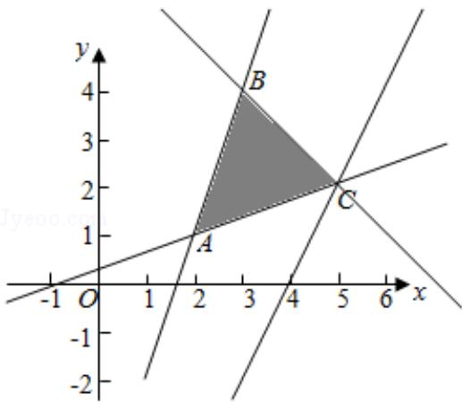

> [!faq]- 2014年全国统一高考数学试卷（理科）（新课标ⅱ）（含解析版）解析
>
> > [!success]- **【答案】** B
>
> > [!note]- **【分析】**
> > 作出不等式组对应的平面区域,利用目标函数的几何意义,利用数形结合
>
> > [!note]- **【解析】**
> > 解：作出不等式组对应的平面区域如图：（阴影部分 ABC）.
> >
> > 由 z=2x-y 得 y=2x-z，
> >
> > 平移直线 y=2x-z，
> >
> > 由图象可知当直线 y=2x-z 经过点 C 时，直线 y=2x-z 的截距最小，
> >
> > 此时 z 最大.
> >
> > 由 $\left\{\begin{aligned}x+y-7&=0\\ x-3y+1&=0\end{aligned}\right.$ ，解得 $\left\{\begin{aligned}x&=5\\ y&=2\end{aligned}\right.$ ，即C(5,2)
> >
> > 代入目标函数 z=2x - y，
> >
> > 得 $z=2\times5-2=8$ .
> >
> > 故选：B.
> >
> > 
