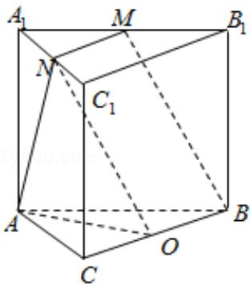

> [!faq]- 2014年全国统一高考数学试卷（理科）（新课标ⅱ）（含解析版）解析
>
> > [!success]- **【答案】** C
>
> > [!note]- **【分析】**
> > 画出图形, 找出 BM 与 AN 所成角的平面角, 利用解三角形求出 BM 与 AN 所成角的余弦值.
>
> > [!note]- **【解析】**
> > 解: 直三棱柱 $ABC - A_{1}B_{1}C_{1}$ 中, $\angle BCA = 90^{\circ}$ , M, N 分别是 $A_{1}B_{1}$ , $A_{1}C_{1}$ 的中点,
> >
> > 如图：BC 的中点为 O，连结 ON，
> >
> > $MN\frac{\parallel1}{2}B_{1}C_{1}=OB$ ，则 MNOB 是平行四边形，BM 与 AN 所成角就是 $\angle ANO$ ，
> >
> > $$
> > \because \mathrm{BC} = \mathrm{CA} = \mathrm{CC} _ {1},
> > $$
> >
> > 设 $BC = CA = CC_{1} = 2$ ， $\therefore CO = 1, AO = \sqrt{5}, AN = \sqrt{5}, MB = \sqrt{B_{1}M^{2} + BB_{1}^{2}} = \sqrt{(\sqrt{2})^{2} + 2^{2}} = \sqrt{6}$ 在 $\triangle ANO$ 中，由余弦定理可得： $\cos \angle ANO = \frac{AN^2 + NO^2 - AO^2}{2AN*NO} = \frac{6}{2\times\sqrt{5}\times\sqrt{6}} = \frac{\sqrt{30}}{10}$
> >
> > 故选：C.
> >
> > 
