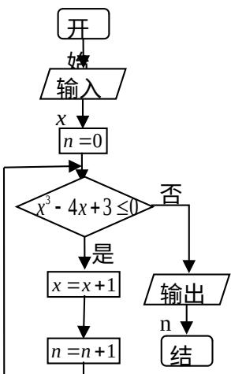

<!-- question-source:start -->
14. 若 $(ax^2 + \frac{b}{x})^6$ 的展开式中 $x^3$ 项的系数为 20，则 $a^2 + b^2$ 的最小值为 \_\_\_\_；

  
束
<!-- question-source:end -->

![[高中/真题/按年份分类/2014/2014年山东省高考数学试卷_理科_word版试卷及解析/填空题/题目/answers/Q00025878A1.md]]
