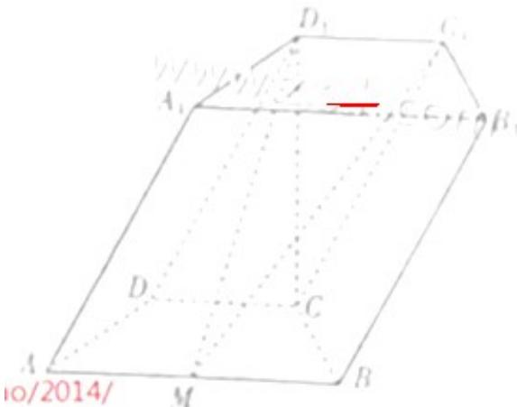
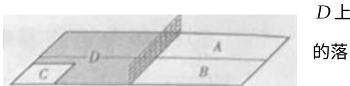

<!-- question-source:start -->
16. (本小题满分 12 分)

已知向量 $a = (m, \cos 2x)$ ， $b = (\sin 2x, n)$ ，设函数 $f(x) = a \cdot b$ ，且 $y = f(x)$ 的图象过点 $(\frac{\pi}{12}, \sqrt{3})$ 和点 $(\frac{2\pi}{3}, -2)$ .

(Ⅰ) 求 m, n 的值;

（Ⅱ）将 $y = f(x)$ 的图象向左平移 $\varphi$ （ $0 < \varphi < \pi$ ）个单位后得到函数 $y = g(x)$ 的图象. 若 $y = g(x)$ 的图象

上各最高点到点 $(0,3)$ 的距离的最小值为 1，求 $y = g(x)$ 的单调增区间.

## 17. (本小题满分 12 分)

如图，在四棱柱 $ABCD - A_{1}B_{1}C_{1}D_{1}$ 中，底面 ABCD 是等腰梯形， $\angle DAB = 60^{\circ}$ ，AB = 2CD = 2，M 是线段 AB 的中点.

(Ⅰ) 求证: $C_{1}M \parallel A_{1}ADD_{1}$ ;

（Ⅱ）若 $CD_{1}$ 垂直于平面 ABCD 且 $CD_{1}=\sqrt{3}$ ，求平面 $C_{1}D_{1}M$ 和平面 ABCD 所成的角（锐角）的余弦值.

## 18. (本小题满分 12 分)

乒乓球台面被网分成甲、乙两部分，如图，

甲上有两个不相交的区域 $A, B$ ，乙被划分为两个不相交的区域 $C, D$ . 某次测试要求队员接到落点在甲上的

来球后向乙回球.规定：回球一次，落点在 $C$ 上记3分，在记1分，其它情况记0分.对落点在 $A$ 上的来球，小明回球点在 $C$ 上的概率为 $\frac{1}{2}$ ，在 $D$ 上的概率为 $\frac{1}{3}$ ；对落点在 $B$ 上

球, 小明回球的落点在 $C$ 上的概率为 $\frac{1}{5}$ , 在 $D$ 上的概率为 $\frac{3}{5}$ . 假设共有两次来球且落在 $A, B$ 上各一次, 小明的两次回球互不影响. 求:

（Ⅰ）小明的两次回球的落点中恰有一次的落点在乙上的概率；

（Ⅱ）两次回球结束后，小明得分之和 $\xi$ 的分布列与数学期望.
<!-- question-source:end -->

![[高中/真题/按年份分类/2014/2014年山东省高考数学试卷_理科_word版试卷及解析/解答题/题目/answers/Q00025880A1.md]]
