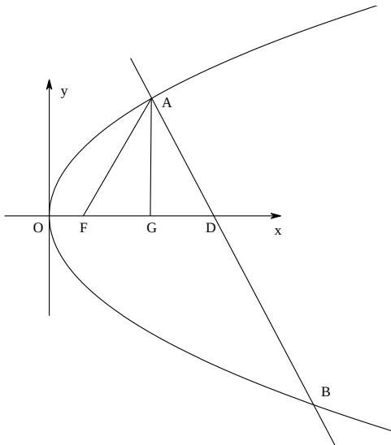

<!-- question-source:start -->
21、解：（Ⅰ）当 $A$ 的横坐标为3时，过 $A$ 作 $AG \perp x$ 轴于 $G$ ，

$$
\left| A F \right| = 3 + \frac {p}{2}
$$

$$
\therefore | F D | = | A F | = 3 + \frac {p}{2}
$$

QV AFD 为等边三角形

$$
\therefore | F G | = \frac {1}{2} | F D | = \frac {3}{2} + \frac {p}{4}
$$

又 $|FG|=3-\frac{p}{2}$

$$
\therefore \frac {3}{2} + \frac {p}{4} = 3 - \frac {p}{2}, \therefore p = 2, \therefore C: y ^ {2} = 4 x
$$

（Ⅱ）（i）设 $A(x_{1},y_{1})$ ， $\left|FD\right| = \left|AF\right| = x_1 + 1$ $\therefore D(x_{1} + 2,0)\therefore k_{AB} = \frac{y_{1}}{2}$ $Ql_1 / / l_{AB}\therefore k_{l_1} = -\frac{1}{2} y_1$ 又 $l_{1}$ 与 $C$ 相切，设切点 $E(x_{E},y_{E})$ $x = \frac{1}{4} y^2,x' = \frac{1}{2} y\therefore \frac{1}{2} y_E = \frac{-2}{y_1},\therefore y_E = -\frac{4}{y_1}$ $x_{E} = \frac{1}{4}\left(-\frac{4}{y_{1}}\right)^{2} = \frac{4}{y_{1}^{2}}\therefore E\left(\frac{4}{y_{1}^{2}}, - \frac{4}{y_{1}}\right),A\left(\frac{y_{1}^{2}}{4},y_{1}\right)$ $\therefore l_{AE}:y - y_1 = \frac{y_1 + \frac{4}{y_1}}{\frac{4}{y_1^2} - \frac{y_1^2}{4}}\left(x - \frac{y_1^2}{4}\right)$

即 $y=\frac{4y_{1}}{y_{1}^{2}-4}(x-1)$ 恒过点 $(1,0)$ ∴ 直线 AE 过定点 $(1,0)$ .

(ii)

$$
l _ {A B}: \mathrm{y} - \mathrm{y} _ {1} = - \frac {\mathrm{y} _ {1}}{2} \left(x - \frac {y _ {1} ^ {2}}{4}\right),
$$

即

$$
\left\{ \begin{array}{l} x = - \frac {2}{y _ {1}} y + \frac {y _ {1} ^ {2}}{4} + 2 \\ y ^ {2} = 4 x \end{array} \right.
$$

$$
y ^ {2} + \frac {8}{y _ {1}} y - (y _ {1} ^ {2} + 8) = 0
$$

$$
y _ {1} + y _ {2} = - \frac {8}{y _ {1}}
$$

$$
\therefore y _ {2} = - y _ {1} - \frac {8}{y _ {1}}
$$

$$
\left| A B \right| = \sqrt {1 + \frac {4}{y _ {1} ^ {2}}} \cdot \left| y _ {1} - y _ {2} \right| = \sqrt {1 + \frac {4}{y _ {1} ^ {2}}} \left| 2 y _ {1} + \frac {8}{y _ {1}} \right|
$$

点 $E$ 到 $AB$ 的距离 $d = \frac{\left|\frac{8}{y_1^2} + \frac{y_1^2}{4} + 2 - \frac{4}{y_1^2}\right|}{\sqrt{1 + \frac{4}{y_1^2}}} = \frac{\left|\frac{4}{y_1^2} + \frac{y_1^2}{4} + 2\right|}{\sqrt{1 + \frac{4}{y_1^2}}}$

$\therefore S = \frac{1}{2} |AB| \cdot d = \frac{1}{2} \left| 2y_1 + \frac{8}{y_1} \right| \left| \frac{4}{y_1^2} + \frac{y_1^2}{4} + 2 \right| = 2 \left| \frac{y_1}{2} + \frac{2}{y_1} \right|^3 \geq 2 \times 2^3 = 16$ ，当且仅当 $y_1 = \pm 2$ 时，“=”成立.

## 选择填空
<!-- question-source:end -->

![[高中/真题/按年份分类/2014/2014年山东省高考数学试卷_理科_word版试卷及解析/解答题/题目/answers/Q00025885A1.md]]
