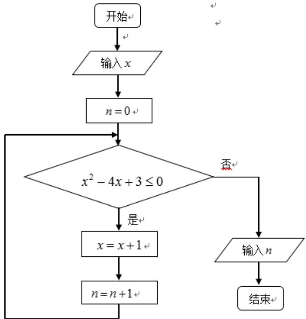

> [!faq]- 2014年山东省高考数学试卷(理科)word版试卷及解析解析
>
> > [!success]- **【答案】** A
>
> > [!note]- **【分析】**
> > 本题未单列分析。
>
> > [!note]- **【解析】**
> > $e_{1}^{2}=\frac{c^{2}}{a^{2}}=\frac{a^{2}-b^{2}}{a^{2}}$ $e_{2}^{2}=\frac{c^{2}}{a^{2}}=\frac{a^{2}+b^{2}}{a^{2}}$ $\therefore(e_{1}e_{2})^{2}=\frac{a^{4}-b^{4}}{a^{4}}=\frac{3}{4}\therefore a^{4}=4b^{4}$ $\therefore\frac{b}{a}=\pm\frac{\sqrt{2}}{2}$
> >
> > ##
> > 二．填空题：本大题共5小题，每小题5分，共25分，答案须填在题中横线上。
> >
> > 
