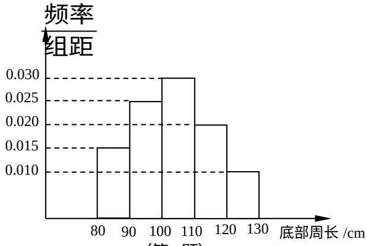

<!-- question-source:start -->
6. 设抽测的树木的底部周长均在区间[80,130]上,其频率分布直方图如图所示,则在抽测的60株树木中,有▲株树木的底部周长小于100cm.

  
(第6题)
<!-- question-source:end -->

![[高中/真题/按年份分类/2014/2014年江苏高考数学试题及答案/填空题/题目/answers/Q00026725A1.md]]
