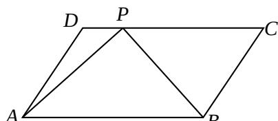

<!-- question-source:start -->
12. 如图，在平行四边形 ABCD 中，已知 AB = 8，AD = 5， $\overrightarrow{CP}=3\overrightarrow{PD}$ ， $\overrightarrow{AP}\cdot\overrightarrow{BP}=2$ ，则 $\overrightarrow{AB}\cdot\overrightarrow{AD}$ 的值是 ▲.

<!-- question-source:end -->

![[高中/真题/按年份分类/2014/2014年江苏高考数学试题及答案/填空题/题目/answers/Q00026731A1.md]]
