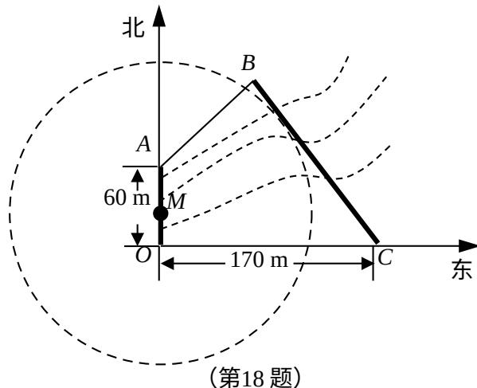

<!-- question-source:start -->
## 18.(本小题满分 16 分)

如图,为了保护河上古桥 OA,规划建一座新桥 BC,同时设立一个圆形学科网保护区.规划要求:新桥 BC 与河岸 AB 垂直;保护区的边界为圆心 M 在线段 OA 上并与 BC 相切的圆.且古桥两端 O 和 A 到该圆上任意一点的距离均不少于 80m. 经测量, 点 A 位于点 O 正北方向 60m 处, 点 C 位于点 O 正东方向 170m 处(OC 为河岸), $\tan \angle BCO = \frac{4}{3}$ .

(1)求新桥 BC 的长;

(2)当 $OM$ 多长时,圆形保护区的面积最大?

<!-- question-source:end -->

![[高中/真题/按年份分类/2014/2014年江苏高考数学试题及答案/填空题/题目/answers/Q00029604A1.md]]
