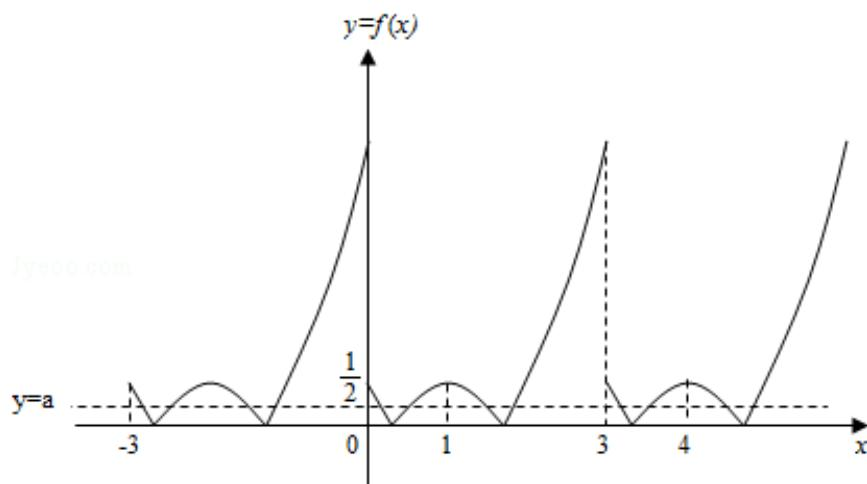

> [!faq]- 2014年江苏高考数学试题及答案解析
>
> > [!success]- **【答案】** $(0, \frac{1}{2})$
>
> > [!note]- **【分析】**
> > 在同一坐标系中画出函数的图象与直线 $y = a$ 的图象，利用数形结合判断 $a$ 的范围即可.
>
> > [!note]- **【解析】**
> > 解: f(x) 是定义在 R 上且周期为 3 的函数, 当 x∈[0,3) 时, f(x)=|x²-2x+1/2|, 若函数 y=f(x)-a 在区间[-3,4]上有 10 个零点 (互不相同), 在同一坐标系中画出函数 f(x) 与 y=a 的图象如图: 由图象可知 a∈(0,1/2).
> >
> > 故答案为： $(0, \frac{1}{2})$ .
> >
> > 
> >
> > 点评：本题考查函数的图象以函数的零点的求法，数形结合的应用.
