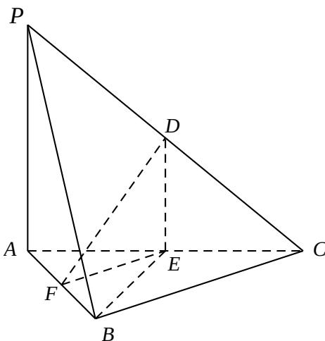

<!-- question-source:start -->
16.(本小题满分 14 分)

如图，在三棱锥 P - ABC 中，D, E, F 分 zxxk 别为棱 PC, AC, AB 的中点. 已知 $PA \perp AC$ , PA = 6,

$$
B C = 8, D F = 5.
$$

求证:
(1)直线 PA // 平面 DEF ;

(2)平面 $BDE \perp$ 平面 $ABC$ .

  
(第16题)
<!-- question-source:end -->

![[高中/真题/按年份分类/2014/2014年江苏高考数学试题及答案/解答题/题目/answers/Q00029602A1.md]]
