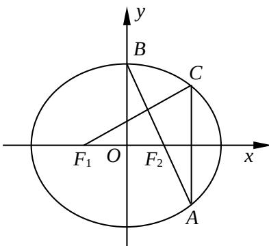

<!-- question-source:start -->
## 17.(本小题满分 14 分)

如图,在平面直角坐标系 xOy 中, $F_{1}, F_{2}$ 分别是椭圆 $\frac{x^{2}}{a^{2}} + \frac{y^{3}}{b^{2}} = 1 (a > b > 0)$ 的左、右焦点，顶点 B 的坐标为 $(0, b)$ ，连结 $BF_{2}$ 并延长交椭圆于点 A，过点 A 作 x 轴的垂线交椭圆于另一点 C，连结 $F_{1}C$ .

(1)若点C的坐标为 $(\frac{4}{3},\frac{1}{3})$ ，且 $BF_{2} = \sqrt{2}$ 求椭圆的方程；

(2)若 $F_{1}C \perp AB$ , 求椭圆离心率 $e$ 的值.

  
(第 17  
题）
<!-- question-source:end -->

![[高中/真题/按年份分类/2014/2014年江苏高考数学试题及答案/解答题/题目/answers/Q00029603A1.md]]
