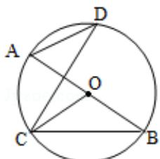

<!-- question-source:start -->
21. (10 分) (2014·江苏) 如图, AB 是圆 O 的直径, C, D 是圆 O 上位于 AB 异侧的两点, 证明: $\angle OCB = \angle D$ .

## 【选修4-2：矩阵与变换】
<!-- question-source:end -->

![[高中/真题/按年份分类/2014/2014年江苏高考数学试题及答案/选择题/题目/answers/Q00026737A1.md]]
