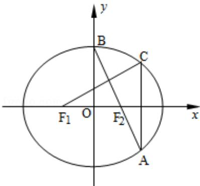

<!-- question-source:start -->
17. (14分) (2014·江苏) 如图, 在平面直角坐标系 xOy 中, $F_{1}$ , $F_{2}$ 分别为椭圆 $\frac{x^{2}}{a^{2}} + \frac{y^{2}}{b^{2}} = 1$ (a > b > 0) 的左、右焦点, 顶点 B 的坐标为 (0, b), 连接 $BF_{2}$ 并延长交椭圆于点 A, 过点 A 作 x 轴的垂线交椭圆于另一点 C, 连接 $F_{1}C$ .

(1) 若点 C 的坐标为 $\left(\frac{4}{3}, \frac{1}{3}\right)$ ，且 $BF_{2}=\sqrt{2}$ ，求椭圆的方程；

(2) 若 $F_{1}C \perp AB$ ，求椭圆离心率 e 的值.

考点：椭圆的简单性质；椭圆的标准方程.

专题：圆锥曲线的定义、性质与方程.
<!-- question-source:end -->

![[高中/真题/按年份分类/2014/2014年江苏高考数学试题及答案/选择题/题目/answers/Q00026743A1.md]]
