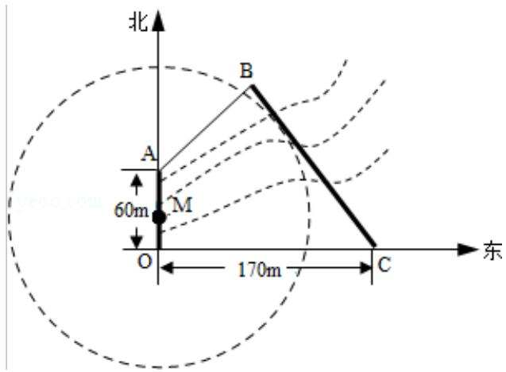

<!-- question-source:start -->
18. (16 分) (2014·江苏) 如图, 为保护河上古桥 OA, 规划建一座新桥 BC, 同时设立一个圆形保护区, 规划要求: 新桥 BC 与河岸 AB 垂直; 保护区的边界为圆心 M 在线段 OA 上并与 BC 相切的圆, 且古桥两端 O 和 A 到该圆上任意一点的距离均不少于 $80 \mathrm{~m}$ , 经测量, 点 A 位于点 O 正北方向 $60 \mathrm{~m}$ 处, 点 C 位于点 O 正东方向 $170 \mathrm{~m}$ 处 (OC 为河岸), $\tan \angle BCO = \frac{4}{3}$ .

(1) 求新桥 BC 的长;

(2) 当 OM 多长时，圆形保护区的面积最大？

考点：圆的切线方程；直线与圆的位置关系.

专题: 直线与圆.
<!-- question-source:end -->

![[高中/真题/按年份分类/2014/2014年江苏高考数学试题及答案/选择题/题目/answers/Q00026744A1.md]]
